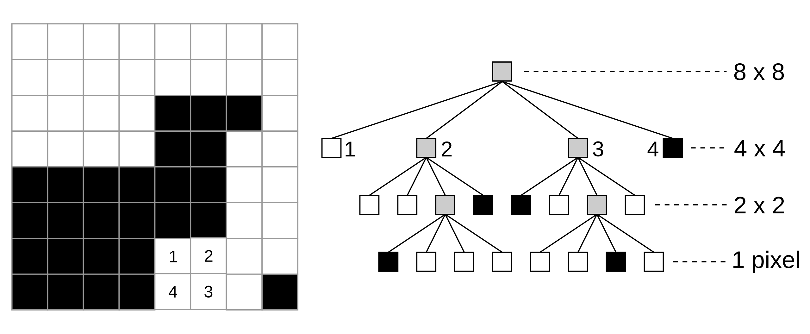

# QuadTree Image Processing

This project implements a QuadTree data structure for efficient image processing tasks, including image compression and inversion. The QuadTree is particularly useful for managing images with large uniform areas, allowing for reduced memory usage and faster processing times.


## Features

- **QuadTree Construction**: Build a QuadTree from an image to represent pixel data hierarchically.
- **Image Compression**: Compress images by reducing the QuadTree to merge similar pixels.


- **Image Inversion**: Invert pixel colors in an image using the QuadTree structure.
- **Efficient Data Handling**: Quickly retrieve and manipulate pixel data using recursive methods.

## Requirements

- Python 3.x
- Pillow library for image handling

You can install the required library using pip:

```bash
pip install Pillow
```


## Future Plans

This project has several exciting features planned for future development:

- **Image Segmentation**: Implement methods to segment images based on color or texture, allowing for more advanced image analysis and processing.
- **Additional Image Processing Functions**: Expand the functionality to include more image processing techniques such as scaling, rotation, and filtering.
- **User Interface**: Develop a graphical user interface (GUI) to make it easier for users to interact with the QuadTree features without needing to modify the code.
- **Performance Optimization**: Analyze and optimize the QuadTree algorithms for faster processing, especially for larger images.

## Contributing
Feel free to contribute to this project! Whether it's fixing bugs, adding new features, or improving the documentation, your contributions are welcome. Here’s how you can help:

1. **Fork the repository**: Create your own copy of the project.
2. **Create a new branch**: Make changes in a dedicated branch to keep your contributions organized.
3. **Make a pull request**: Submit your changes for review.

Thank you for your interest in improving this project!


## References

For more information on Quadtrees, please refer to the following resource:

- [Quadtree - Wikipedia](https://en.wikipedia.org/wiki/Quadtree#:~:text=A%20quadtree%20is%20a%20tree,into%20four%20quadrants%20or%20regions.)
